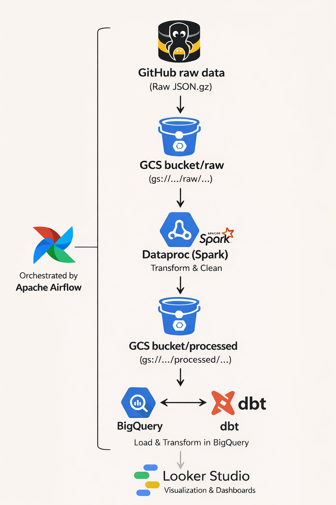
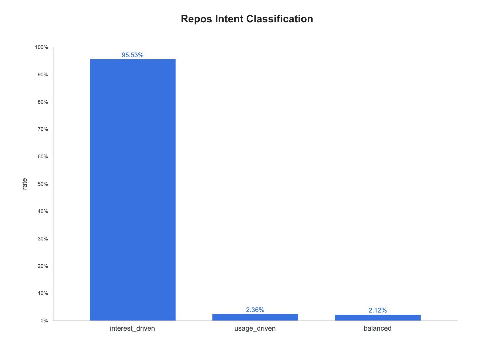
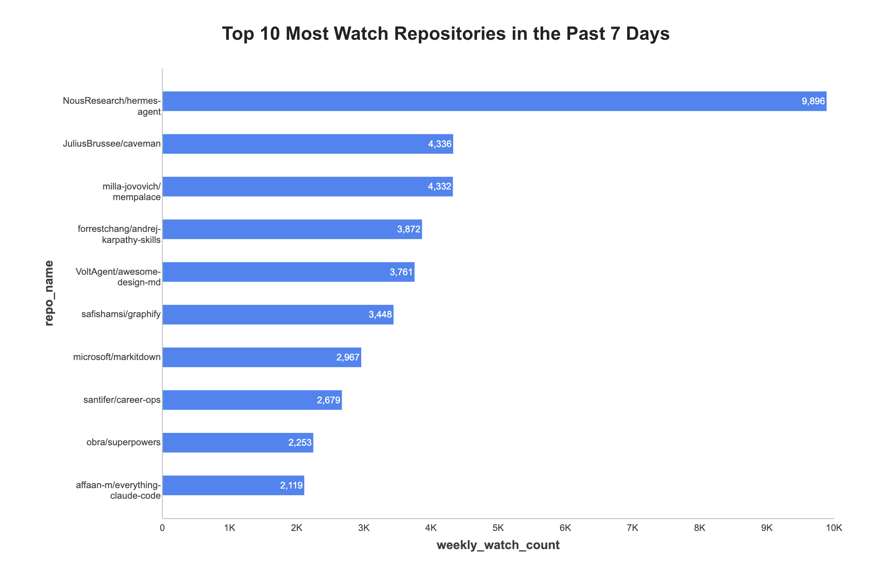
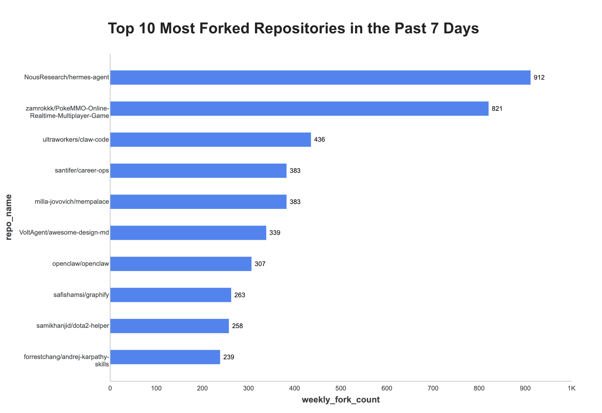
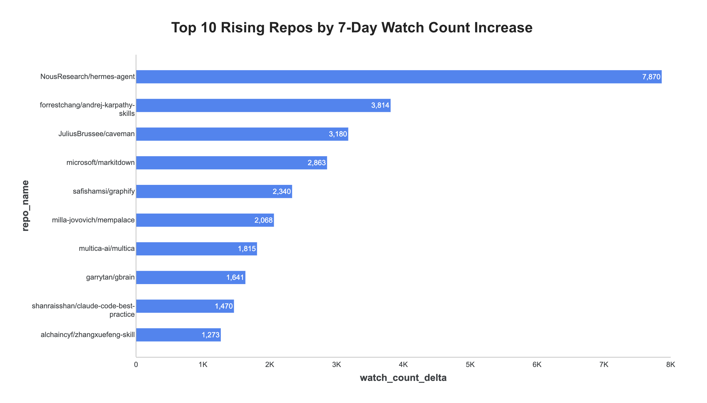

# GHArchive Events Platform

This project **demonstrates GitHub watch and fork** activity via an end-to-end pipeline: ingest hourly **GH Archive** JSON to **GCS**, curate those events with a **PySpark** batch job on **Google Cloud Dataproc** (parquet back to **GCS**), **load** into **BigQuery**, model with **dbt**—all orchestrated by **Airflow** (Docker Compose for local runs). Dashboards use **Looker Studio**.

In this dataset, **watch** events reflect users starring or watching a repository (signals of interest); **fork** events reflect users creating their own copy of a repository to modify or extend it.

## Table of contents

1. [Project overview](#project-overview)
2. [Data sources](#data-sources)
3. [Tech stack](#tech-stack)
4. [Set up](#set-up)
5. [Data pipeline orchestration (Airflow)](#data-pipeline-orchestration-airflow)
6. [Data transformation](#data-transformation)
7. [Data warehouse](#data-warehouse)
8. [Data visualization](#data-visualization)

<a id="project-overview"></a>
## Project overview

This project is built to create an end-to-end analytics pipeline for GitHub public event data.

Work flow:



- **Extract** — Download hourly GH Archive JSON from the public feed and store it in **Google Cloud Storage**.
- **Transform** — Run a **PySpark** job on **Dataproc** to read that JSON from **GCS**, keep **watch** and **fork** events, and write **Parquet** back to **GCS** (processed layout).
- **Load** — Load curated **Parquet** from **GCS** into **BigQuery** **`source_watch_events`** and **`source_fork_events`**.
- **Model** — Run **dbt** in BigQuery **layer by layer**, with **tests after each layer** so bad data does not reach downstream models. The DAG runs: **source** tests on loaded tables → **staging** `dbt run` + **staging** tests → **fact** `dbt run` + **fact** tests → **marts** `dbt run` + **marts** tests. If a test fails, the Airflow task fails and later layers (fact, marts) are skipped for that run.

**Airflow** orchestrates these steps; **Docker Compose** runs Airflow locally for development; **Terraform** provisions core GCP resources (see `terraform/`).

<a id="data-sources"></a>
## Data sources

### GHArchive (source)

This pipeline is built on **[GHArchive](https://www.gharchive.org/)**, a public record of GitHub events. Each **hour** is published as a gzip-compressed JSON file on `data.gharchive.org` (for example `2026-03-15-14.json.gz`). Each **line** in a decompressed file is one JSON object describing a single event (type, actor, repository, timestamps, and a payload whose shape depends on the event type).

GHArchive reflects **public** GitHub activity only; retention, licensing, and acceptable use are described on the GHArchive site. This project does not redistribute raw dumps—it **downloads** them for processing and stores copies in your own GCS bucket.

### What this repository uses

The ingestion job pulls hourly files for a **configurable UTC range** (defaults in code: about the **last 14 days** through an end hour offset by roughly **three hours** from “now” so files that are not published yet are not requested).

**Spark transform** focuses on **Watch** and **Fork** activity: it reads JSON for a **15-calendar-day window** relative to the DAG’s logical date (the fifteen UTC dates `execution_date - 1` through `execution_date - 15`), loads matching events, and writes two BigQuery tables:

- `source_watch_events`
- `source_fork_events`

<a id="tech-stack"></a>
## Tech stack

- **PySpark** — Expresses the batch transform: read GH Archive JSON from GCS in parallel, keep watch/fork events, write Parquet back to GCS, and load BigQuery source tables (the job runs on Dataproc).
- **Apache Airflow** — Orchestrates the workflow: ingest files to GCS, trigger the transform, then run dbt models and tests against BigQuery.
- **Docker / Docker Compose** — Runs Airflow locally with the **scheduler** and **triggerer** only (no web UI; **§5** explains why); use the **CLI** to trigger DAGs and inspect runs.
- **Google Cloud Storage** — Holds raw hourly GH Archive JSON and the Parquet output the Spark job writes before loading into BigQuery.
- **Google Cloud Dataproc** — Managed Spark service where the **PySpark** batch job runs.
- **BigQuery** — Data warehouse for `source_watch_events` / `source_fork_events` and for all **dbt** models built on top of them.
- **dbt** — Analytic engineering tool turns raw source tables into staging, facts, and mart tables.
- **Terraform** — Provisions GCP pieces (for example bucket, BigQuery dataset) so infrastructure matches what the pipeline expects.

<a id="set-up"></a>
## Set up

This walkthrough assumes you run Airflow with Docker Compose from the `airflow/` directory. The pipeline DAG is `gharchive_events_pipeline`: it ingests GHArchive hourly files to GCS, loads curated watch/fork events into BigQuery with Spark, then runs dbt models on top of those tables.

### Prerequisites

- **Docker** and **Docker Compose** (`docker compose`).
- **GCP**: New [project](https://console.cloud.google.com/), **billing** on, **project ID** + **region** (e.g. `us-central1`) for Terraform and **`.env`**. Enable **Cloud Storage**, **BigQuery**, **Dataproc**, and **Cloud Logging** APIs.
- **Terraform** `>= 1.5` (see **`terraform/`**) for infra after clone.
- **Service account** JSON for Airflow/Spark/dbt (`GHARCHIVE_GOOGLE_APPLICATION_CREDENTIALS_LOCAL`): **BigQuery Data Editor**, **BigQuery Job User**, **Dataproc Editor**, **Service Account User**, **Service Usage Admin**, **Storage Object Admin**. **`terraform apply`** needs a user or SA that can manage project resources.

### 1. Clone the repository

### 2. Provision GCP resources with Terraform

Edit **`terraform/terraform.tfvars`**: set **`project_id`** and **`region`** to your GCP project and region. Optionally set **`bucket_name`** and **`dataset_id`**; otherwise **`terraform/var.tf`** defaults apply. Use the **same** project, region, bucket, and dataset names in **`.env`** (next step).

Authenticate Terraform to your Google account (for example **`gcloud auth application-default login`**) or use credentials appropriate for your environment, then:

```bash
cd terraform
terraform init
terraform apply
```

This creates the raw **GCS** bucket, and the **BigQuery** dataset.

### 3. Configure environment variables for Airflow

**First** edit **`.env.example`** at the **repository root** (before copying). Set **`GHARCHIVE_GCP_PROJECT_ID`** and **`GHARCHIVE_GOOGLE_APPLICATION_CREDENTIALS_LOCAL`** to match **your** project and key file. **`GHARCHIVE_GCS_BUCKET_NAME`**, **`GHARCHIVE_GCS_RAW_PREFIX`**, **`GHARCHIVE_GCS_PROCESSED_PREFIX`**, and **`GHARCHIVE_BQ_DATASET`** can stay at the **defaults shown in `.env.example`** if those names match what **Terraform** created (or your existing bucket and dataset); change them only when you use different resource names.

| Variable | Purpose |
| --- | --- |
| `GHARCHIVE_GCP_PROJECT_ID` | GCP project ID; must match Terraform |
| `GHARCHIVE_GCP_REGION` | GCP region for dbt and Dataproc (see default in **`.env.example`**) |
| `GHARCHIVE_GOOGLE_APPLICATION_CREDENTIALS_LOCAL` | Absolute path on your host to the service account JSON key (mounted for Airflow and dbt) |
| `GHARCHIVE_DATAPROC_SERVICE_ACCOUNT` | Service account email for Dataproc Serverless batches (transform tasks), e.g. `my-sa@PROJECT_ID.iam.gserviceaccount.com` |

Then copy the file Compose actually reads:

```bash
cp .env.example airflow/.env
```

Only **`airflow/.env`** is loaded (**`airflow/docker-compose.yml`** `env_file`). A **`.env`** at the **repository root** is unused by this project and can be deleted if you do not rely on it for other tools. Real secrets stay in **`airflow/.env`** (gitignored); the only committed template is **`.env.example`**.

### 4. Build the Airflow image

From the **repository root** (so the build context includes `src/`, `gharchive_dbt/`, etc.):

```bash
docker build -f airflow/Dockerfile -t gharchive-airflow:latest .
```

### 5. Start Airflow

```bash
cd airflow
docker compose up
```

Wait until `airflow-init` has finished and **`airflow-scheduler`** and **`airflow-triggerer`** are running.

### 6. Verify the DAG is loaded

In another terminal (still with Compose running):

```bash
cd airflow
docker compose exec airflow-scheduler airflow dags list | grep gharchive_events_pipeline
```

You should see `gharchive_events_pipeline`. New DAGs start **paused**; unpause with:

```bash
docker compose exec airflow-scheduler airflow dags unpause gharchive_events_pipeline
```

### 7. Run the pipeline

The DAG has **no schedule** (`schedule=None`), so start a run with **`airflow dags trigger`** from the CLI below.

**Logical date** (**`ds`**) is the pipeline **anchor**: the Spark transform, **`bq load`** into BigQuery, and **dbt** **`anchor_date`** all use the same **`ds`**, so marts stay aligned. Trigger with the default logical date or add **`--exec-date YYYY-MM-DD`** for a specific day.

```bash
docker compose exec airflow-scheduler airflow dags trigger gharchive_events_pipeline
# optional: append --exec-date 2026-03-15
```

**Transform task shows `deferred`:** **`transform_raw_to_processed_gcs`** often stays **deferred** while the **PySpark** job runs on **Google Cloud Dataproc** (the Airflow task is waiting on the batch, not executing Spark locally). In **Google Cloud Console → Dataproc → Batches**, open the active batch and use its **Logs** (and batch detail) to follow driver/executor output. The task moves to **success** when Dataproc finishes the batch successfully.

### 8. Check DAG run status (task states)

After you trigger the DAG in **§7**, use the **DAG run id** to inspect task states. With **Docker Compose** still running, open **another terminal**, **`cd`** into **`airflow/`**, then:

1. Copy the **DAG run id** (`run_id`). It may appear in the **§7** trigger output; if not, list recent runs and take the latest **`run_id`** (for example `manual__2026-04-16T23:57:29+00:00`):

   ```bash
   docker compose exec airflow-scheduler airflow dags list-runs -d gharchive_events_pipeline
   ```

2. Run **`airflow tasks states-for-dag-run`** with the DAG id and your **`run_id`**. **Quote** the **`run_id`** so characters such as **`+`** are not interpreted by the shell:

   ```bash
   docker compose exec airflow-scheduler airflow tasks states-for-dag-run gharchive_events_pipeline '<DAG_RUN_ID>'
   ```

   Example when **`run_id`** is **`manual__2026-04-16T23:57:29+00:00`**:

   ```bash
   docker compose exec airflow-scheduler airflow tasks states-for-dag-run gharchive_events_pipeline 'manual__2026-04-16T23:57:29+00:00'
   ```

You get a table of **task id** and **state** (`success`, `running`, `deferred`, `failed`, …) for that run.

### 9. Check the results

**Google Cloud Storage**

- In the console or `gsutil`, check **both** `gs://<GHARCHIVE_GCS_BUCKET_NAME>/<GHARCHIVE_GCS_RAW_PREFIX>/` (hourly raw JSON: `year=…/month=…/day=…/hour=…`) and `gs://<GHARCHIVE_GCS_BUCKET_NAME>/<GHARCHIVE_GCS_PROCESSED_PREFIX>/` (processed Parquet: `watch/…` and `fork/…` with `event_date=…`) so ingest and transform both landed objects.

**BigQuery**

- In the BigQuery UI, select project `GHARCHIVE_GCP_PROJECT_ID` and dataset `GHARCHIVE_BQ_DATASET`.
- **Source tables** (written by Spark): `source_watch_events`, `source_fork_events`.
- **dbt models** (same dataset), including:
  - Staging: `stg_watch_events`, `stg_fork_events`
  - Fact: `fct_repo_daily_watch_fork_metrics`
  - Marts: `marts_watch_top_repos_7d`, `marts_fork_top_repos_7d`, `marts_watch_rasing_repos_7d`, `marts_star_to_fork_conversion`, `marts_repo_intent_classification`

### Troubleshooting notes

- If **dbt** fails with “No such file or directory” for the key file, ensure `airflow/.env` still points `GHARCHIVE_GOOGLE_APPLICATION_CREDENTIALS_LOCAL` at a real file on the host and recreate the stack after edits: `docker compose up -d --force-recreate`.
- If **ingest** or **transform** fails with auth or API errors, confirm the service account roles and that the bucket and dataset exist in the configured project and region.
- **Transform** runtime and BigQuery bytes scanned grow with the size of the input window; start with a recent logical date and a smaller calendar window in code only if you have customized the project for tests.

<a id="data-pipeline-orchestration-airflow"></a>
## Data pipeline orchestration (Airflow)

The **`gharchive_events_pipeline`** DAG in Apache **Airflow** runs the batch workflow: **ingest** hourly files to **GCS**, **upload** the transform script, **submit** a **Dataproc** batch for **PySpark** that reads JSON from **GCS** and writes **Parquet** back to **GCS**, **load** **`source_watch_events`** and **`source_fork_events`** into **BigQuery**, then **run** layered **dbt** models and tests.

Example output from **`airflow tasks states-for-dag-run`** (see **§8**): each row shows **`task_id`** and **`state`** (`success`, `deferred`, `failed`, or **`None`** until upstream tasks finish).


**Why no webserver?** Compose runs only the **scheduler** and **triggerer**, not **`airflow-webserver`**, to keep **RAM and CPU** usage low for local development—the web UI adds another process that often **causes OOM** on smaller machines. Use the **CLI** (`airflow dags trigger`, `airflow tasks logs`, …). To use the web UI, add an **`airflow-webserver`** service to your Compose file (see the [Airflow Docker Compose guide](https://airflow.apache.org/docs/apache-airflow/stable/howto/docker-compose/index.html)) and **raise Docker’s memory limit** (for example in Docker Desktop **Settings → Resources**) if you **prefer the browser** for triggering or monitoring DAGs.

<a id="data-transformation"></a>
## Data transformation

The DAG submits **PySpark** as a **Google Cloud Dataproc** batch (**`DataprocCreateBatchOperator`**). That job:

- reads GH Archive **JSON** from **GCS** (Hive-style paths by UTC date/hour)
- keeps **Watch** and **Fork** events
- writes **Parquet** back to **GCS**
- loads **`source_watch_events`** and **`source_fork_events`** in **BigQuery**

**Why Dataproc instead of Spark inside Airflow**

Airflow is for **orchestration** (scheduling and dependencies), not for hosting heavy, **I/O-bound** Spark. Running Spark inside the Airflow container **mixes orchestration with compute**: the worker carries both scheduling noise and large **GCS** reads/writes, which raises **failure risk** and makes debugging harder. **Dataproc** (including **Serverless**-style batches) runs Spark on **managed cluster capacity**—better suited to big scans and **Parquet** writes—while Airflow only **submits and tracks** the batch, which keeps the pipeline **clearer and more stable**.

<a id="data-warehouse"></a>
## Data warehouse

**BigQuery** holds the source tables above plus **dbt** models in `GHARCHIVE_BQ_DATASET`: staging (`stg_*`), fact (`fct_repo_daily_watch_fork_metrics`), and marts used for reporting. Time-window marts use the **`anchor_date`** dbt variable when the DAG runs (same as Airflow **logical date**).

### dbt data tests

The DAG passes **`anchor_date`** = **`{{ ds }}`** to every **`dbt`** command. It **tests sources**, then **runs and tests staging** (`tag:layer_staging`), then **runs and tests the fact** layer (`tag:layer_fct`), then **runs and tests marts** (`tag:layer_marts`). Tests defined in **`gharchive_dbt/models/`** YAML (uniqueness, not-null, accepted values, custom macros, and similar) must pass before the next layer runs; you can mirror the same **`dbt test`** / **`dbt run`** selections locally with the same **`--vars`**.

<a id="data-visualization"></a>
## Data visualization

The **Looker Studio** charts below read from **dbt** marts in **BigQuery**; the data will differ from run to run depending on the **logical date** you use when you trigger the DAG.

### Repo intent classification summary

Share of **active** repos in three buckets from **forks ÷ watches**; windows use the DAG’s **anchor date** (seven full UTC days ending the day **before** anchor, anchor day excluded—same logic as **`anchor_date`** / **`current_date()`** in dbt). **low_signal** repos are dropped. Mart: `marts_repo_intent_classification`.

- **usage_driven** — ratio ≥ **1.2** (more fork-heavy → often **using** the code).
- **interest_driven** — ratio ≤ **0.5** (more watch-heavy → **interest** over forks).
- **balanced** — between those cutoffs.



### Top watch repos (7d)

Repositories that earned the most **watch** events (for example stars) in the **last seven days**, usually shown as a top 10 style ranking. A taller bar or higher rank means more watch activity on that repo this week.



### Top fork repos (7d)

Same window (**last seven days**), but for **fork** events—repos users copied most often. Use it to see which projects are being forked heavily right now.



### Rising watch repos

Repos where **watch** activity is **growing** compared with the **previous** week, not only the biggest totals. It surfaces momentum: projects that had solid interest this week and **gained more watches than the week before**, ordered by that increase.


