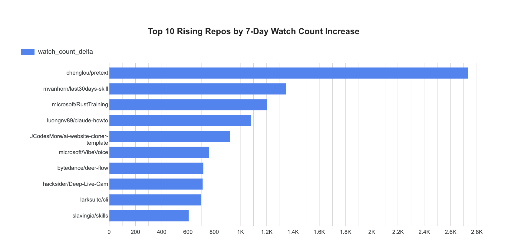

# GHArchive Events Platform

A data engineering project for ingesting GHArchive event data, storing raw files in Google Cloud Storage, loading data into BigQuery, and transforming it with dbt.

## Overview

This project is built to create an end-to-end analytics pipeline for GitHub public event data.

Work flow:

GHArchive → GCS → BigQuery → dbt

Airflow is used for orchestration, Docker is used for local development, and Terraform is used for infrastructure provisioning.

## Data resources

### GHArchive (source)

This pipeline is built on **[GHArchive](https://www.gharchive.org/)**, a public record of GitHub events. Each **hour** is published as a gzip-compressed JSON file on `data.gharchive.org` (for example `2026-03-15-14.json.gz`). Each **line** in a decompressed file is one JSON object describing a single event (type, actor, repository, timestamps, and a payload whose shape depends on the event type).

GHArchive reflects **public** GitHub activity only; retention, licensing, and acceptable use are described on the GHArchive site. This project does not redistribute raw dumps—it **downloads** them for processing and stores copies in your own GCS bucket.

### What this repository uses

The ingestion job pulls hourly files for a **configurable UTC range** (defaults in code: about the **last 14 days** through an end hour offset by roughly **three hours** from “now” so files that are not published yet are not requested). The Airflow DAG runs ingestion with **`--skip-if-exists`**, so hours already present in the bucket are not uploaded again.

**Spark transform** focuses on **Watch** and **Fork** activity: it reads JSON for a **15-calendar-day window** relative to the DAG’s logical date (the fifteen UTC dates `execution_date - 1` through `execution_date - 15`), loads matching events, and writes two BigQuery tables:

- `source_watch_events`
- `source_fork_events`

Dataset name comes from `GHARCHIVE_BQ_DATASET`. **dbt** then builds views and tables (staging, a daily fact model, and marts) on top of those sources for analytics and dashboards.

### Layout in Google Cloud Storage

Under your configured prefix (`GHARCHIVE_GCS_PREFIX`, default `gharchive/raw`), objects follow a Hive-style path:

```text
<prefix>/year=YYYY/month=MM/day=DD/hour=HH/YYYY-MM-DD-H.json.gz
```

Example:

```text
gs://<bucket>/gharchive/raw/year=2026/month=03/day=15/hour=14/2026-03-15-14.json.gz
```

That layout matches how the transform step discovers inputs for each day partition.

## Tech Stack

- Python
- Apache Airflow
- Docker / Docker Compose
- Google Cloud Storage
- BigQuery
- dbt
- Terraform

## Project Structure

```text
gharchive-events-platform/
├── airflow/
│   ├── dags/
│   ├── docker-compose.yaml
│   └── Dockerfile
├── gharchive_dbt/
├── src/
│   └── gharchive_events/
├── tests/
├── pyproject.toml
└── README.md
```

## Onboarding

This walkthrough assumes you run Airflow with Docker Compose from the `airflow/` directory. The pipeline DAG is `gharchive_events_pipeline`: it ingests GHArchive hourly files to GCS, loads curated watch/fork events into BigQuery with Spark, then runs dbt models on top of those tables.

### Prerequisites

- **Docker** and **Docker Compose** (Compose V2: `docker compose`).
- A **Google Cloud project** with:
  - A **GCS bucket** for raw JSON (matches `GHARCHIVE_GCS_BUCKET_NAME`).
  - A **BigQuery dataset** for analytics (matches `GHARCHIVE_BQ_DATASET`). Create it in the same region you set in `GHARCHIVE_GCP_REGION` (for example `us-central1`).
- A **service account JSON key** whose roles include at least working access to that bucket and BigQuery (for example Storage Object Admin on the bucket and BigQuery Data Editor / Job User on the project, tuned to your security standards).
- Enough local **CPU/RAM** for Spark inside the Airflow container; transforms over many hours of data are heavier than dbt alone.

### 1. Clone the repository

```bash
git clone <your-fork-or-repo-url>
cd gharchive-event-platform
```

### 2. Configure environment variables for Airflow

Compose loads **`airflow/.env`** (paths are relative to the `airflow/` folder when you run `docker compose`).

Create that file from the root example and edit the values:

```bash
cp .env.example airflow/.env
```

Set at least:

| Variable | Purpose |
|----------|---------|
| `GHARCHIVE_GCP_PROJECT_ID` | GCP project id |
| `GHARCHIVE_GCP_REGION` | BigQuery location / regional alignment (e.g. `us-central1`) |
| `GHARCHIVE_GCS_BUCKET_NAME` | Bucket for raw GHArchive files |
| `GHARCHIVE_GCS_PREFIX` | Object prefix under the bucket (default in example: `gharchive/raw`) |
| `GHARCHIVE_BQ_DATASET` | BigQuery dataset for source and dbt models |
| `GHARCHIVE_GOOGLE_APPLICATION_CREDENTIALS_LOCAL` | **Absolute path on your machine** to the service account JSON file |

Compose bind-mounts that key into the container as `/opt/airflow/keys/gcp-key.json` and sets `GOOGLE_APPLICATION_CREDENTIALS` for Python and Spark. dbt inside the container uses the in-container key path supplied by Compose; you do **not** need to change `profiles.yml` for Docker.

On Linux, if file permissions block the container user from reading mounted files, set `AIRFLOW_UID` in `airflow/.env` to your user id (`id -u`) so the Airflow process matches your host uid.

### 3. Build the Airflow image

From the **repository root** (so the build context includes `src/`, `gharchive_dbt/`, etc.):

```bash
docker build -f airflow/Dockerfile -t gharchive-airflow:latest .
```

### 4. Start Airflow

```bash
cd airflow
docker compose up
```

Wait until `airflow-init` has finished and the webserver and scheduler are running. The UI is at [http://localhost:8080](http://localhost:8080) with the default admin user created by init (`admin` / `admin` unless you changed the init command in `docker-compose.yaml`).

### 5. Verify the DAG is loaded

In another terminal (still with Compose running):

```bash
cd airflow
docker compose exec airflow-scheduler airflow dags list | grep gharchive_events_pipeline
```

You should see `gharchive_events_pipeline`. New DAGs start **paused**; unpause it in the UI or run:

```bash
docker compose exec airflow-scheduler airflow dags unpause gharchive_events_pipeline
```

### 6. Run the pipeline and pick a logical date

The DAG is **not** on a schedule (`schedule=None`), so you trigger it manually.

- **In the UI**: open the DAG → **Trigger DAG** → choose a **Logical date** (Airflow calls this the data interval anchor; the transform task passes it as `--execution-date {{ ds }}` in `YYYY-MM-DD` form). Use a date for which you expect GHArchive data to exist (recent UTC days).

- **From the CLI** (example logical date):

```bash
docker compose exec airflow-scheduler airflow dags trigger gharchive_events_pipeline \
  --exec-date 2026-03-15
```

Task order: `ingest_gharchive_to_gcs` → `transform_raw_to_bq_source` → `dbt_run`.

- **Ingest** downloads GHArchive hours and writes objects under your GCS prefix (`--skip-if-exists` skips objects already present).
- **Transform** reads a multi-day window of GCS inputs for that execution date and writes BigQuery tables `source_watch_events` and `source_fork_events` in `GHARCHIVE_BQ_DATASET`.
- **dbt** builds staging views, the fact table, and marts in the same dataset.

Watch each task turn green in the UI, or stream logs:

```bash
docker compose exec airflow-scheduler airflow tasks logs gharchive_events_pipeline \
  transform_raw_to_bq_source 2026-03-15
```

(Replace the task id and date to match your run.)

### 7. Check the results

**Airflow**

- **Browse → Task Instances**: filter by DAG id; confirm all three tasks succeeded for your run date.
- Open a task → **Log** for stderr/stdout (Spark and dbt output).

**Google Cloud Storage**

- In the console or `gsutil`, list objects under `gs://<GHARCHIVE_GCS_BUCKET_NAME>/<GHARCHIVE_GCS_PREFIX>/` and confirm hourly files appear for the days you care about.

**BigQuery**

- In the BigQuery UI, select project `GHARCHIVE_GCP_PROJECT_ID` and dataset `GHARCHIVE_BQ_DATASET`.
- **Source tables** (written by Spark): `source_watch_events`, `source_fork_events`.
- **dbt models** (same dataset), including:
  - Staging: `stg_watch_events`, `stg_fork_events`
  - Fact: `fct_repo_daily_watch_fork_metrics`
  - Marts: `marts_watch_top_repos_7d`, `marts_fork_top_repos_7d`, `marts_watch_rasing_repos_7d`, `marts_star_to_fork_conversion`

Run a quick row count or `SELECT *` on a mart to confirm data.

**dbt only (optional)**

To rerun models without the full DAG:

```bash
docker compose exec airflow-scheduler bash -lc \
  'cd /opt/app/gharchive_dbt && dbt run --profiles-dir /opt/app/gharchive_dbt'
```

To rebuild a single model (example):

```bash
docker compose exec airflow-scheduler bash -lc \
  'cd /opt/app/gharchive_dbt && dbt run --profiles-dir /opt/app/gharchive_dbt --select marts_watch_top_repos_7d'
```

### Troubleshooting notes

- If **dbt** fails with “No such file or directory” for the key file, ensure `airflow/.env` still points `GHARCHIVE_GOOGLE_APPLICATION_CREDENTIALS_LOCAL` at a real file on the host and recreate the stack after edits: `docker compose up -d --force-recreate`.
- If **ingest** or **transform** fails with auth or API errors, confirm the service account roles and that the bucket and dataset exist in the configured project and region.
- **Transform** runtime and BigQuery bytes scanned grow with the size of the input window; start with a recent logical date and a smaller calendar window in code only if you have customized the project for tests.

## Data Visualization

### Top watch repos (7d)


### Top fork repos (7d)


### Rising watch repos



